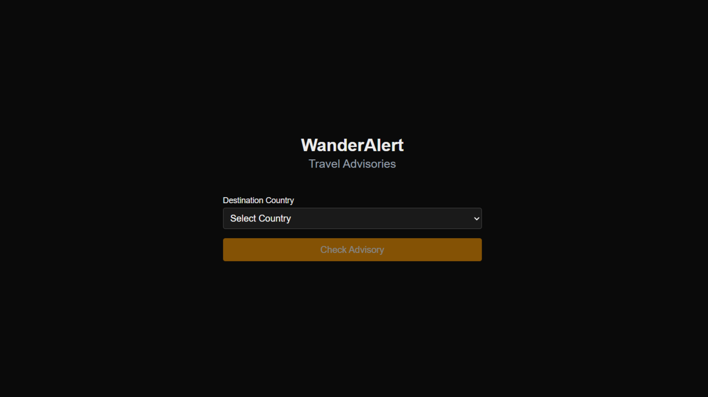

# **WanderAlert**

WanderAlert is a lightweight travel advisory checker that gives users instant access to up-to-date safety levels for every country. Built for travelers who value awareness and smart decisions, it offers a no-fluff way to check global risk levels before any trip.

## **Features**

- **Real-Time Advisory Lookups** – Instantly view current travel advisory levels by country.
- **Color-Coded Alert** – Clear visual levels (1–4) make it easy to assess travel risks at a glance.
- **Live U.S. Government Data** – Scrapes the latest advisories from official sources to stay current.
- **Minimal & Responsive UI** – No distractions, no accounts, just safety info when you need it.

## **Snapshots**

